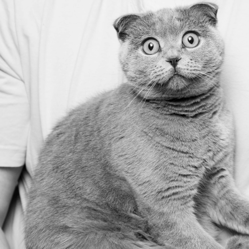
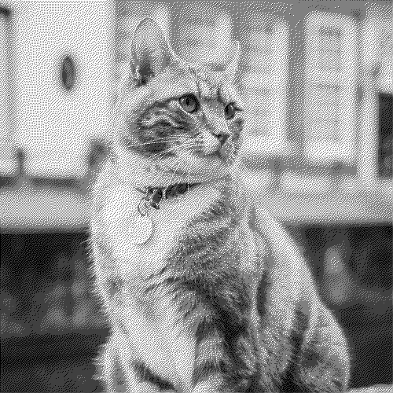
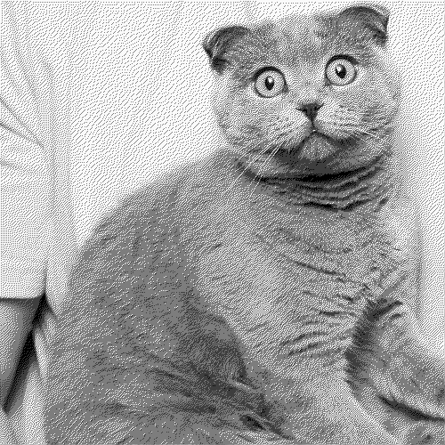
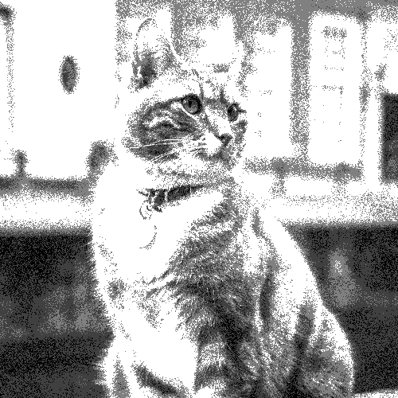
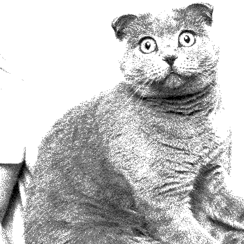
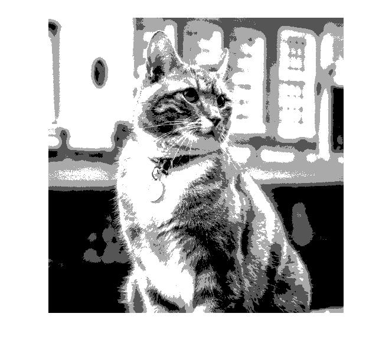
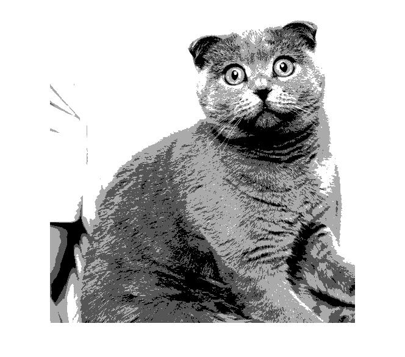

# Dithering Algorithms

Algoritmos feitos para serem usados em imagens em escala de cinza para a cadeira de Fundamentos de Processamento de Imagens - UFRGS

Imagens Originais convertidas para escala cinza com 8 bits/pixel

  
  

___

- Resultado da aplicação do <strong>Algoritmo Floyd Steinberg</strong> usando 2 bits/pixel:

  
  

___

- Resultado da aplicação de <strong>Modularização Aleatória</strong> com ruído Gaussiano usando 2 bits/pixel:

  
  

___

- Resultado da aplicação da <strong>Limiarização</strong> usando 2 bits/pixel para comparação com os outros dois algoritmos:

  
  

